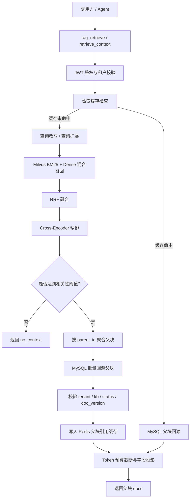

# retrieve_skill

可独立复用的 RAG 检索组件。它只做“检索并返回权威父块上下文”，不包含回答生成、LangGraph 编排或业务话术；既可作为本地 Python 组件调用，也可以通过 MCP 工具 `rag_retrieve` 对外提供服务。

调用方契约见 [SKILL.md](SKILL.md)，完整配置见 [.env.example](.env.example) 与 [common_core 配置文档](../common_core/docs/config.md)。

## 能力

- Milvus Dense Embedding + BM25 混合召回，RRF 融合，Cross-Encoder 精排，相关性阈值门控。
- 多租户隔离：JWT 鉴权、Milvus 过滤、MySQL 回源三层校验。
- 子块召回 + 父块回源：Milvus 只存子块，MySQL 保存权威父块；回源时校验 tenant / kb / status / doc_version。
- 父块引用级 Redis 缓存：缓存签名覆盖查询、改写、过滤、模型与数据版本；命中后仍回源 MySQL 重建上下文。
- 查询改写 / 查询扩展、token 预算截断、Prometheus 指标、结构化错误契约与关键依赖故障 fail-closed。

## 处理流程



## 快速上手

组件依赖 `common_core`，发布到私有源后可直接安装：

```powershell
pip install "retrieve-skill[mysql]"
```

monorepo 本地开发时可执行：

```powershell
pip install -e ../common_core --no-deps
pip install -e . --no-deps
pip install ".[mysql]"
```

复制 `.env.example` 为 `.env` 并配置 Milvus / MySQL / Redis / Embedding / 鉴权后，按本地组件使用：

```python
import asyncio

from common_core.context import AgentContext
from retrieve_skill.builder import build_pipeline

pipeline = build_pipeline()
ctx = AgentContext(tenant_id="merchant", kb_id="merchant_kb", request_id="req-1")

async def main() -> None:
    result = await pipeline.retrieve_context("当前支持的售后流程是什么？", context=ctx)
    print(result.status, result.docs)

asyncio.run(main())
```

以 MCP 方式启动时，PyCharm 直接运行 `src/retrieve_skill/mcp.py` 即可；命令行入口为：

```powershell
retrieve-skill-mcp
```

需要 HTTP 传输时可追加 `--transport streamable-http --port 8000`。生产部署与配置交付见 [docs/deployment.md](../docs/deployment.md)。

## Docker 运行

镜像默认以 `streamable-http` 方式监听 `0.0.0.0:8000`，入口命令是 `retrieve-skill-mcp`。

```bash
# 本地构建
docker build -t retrieve-skill:0.1.0 .

# 用 .env 提供 Milvus / MySQL / Redis / LLM 等配置
docker run --rm -p 8000:8000 --env-file .env retrieve-skill:0.1.0
```

推送 tag `v0.1.0` 后可从 GHCR 直接拉取：

```bash
docker pull ghcr.io/<owner>/retrieve_pipeline:v0.1.0
docker run --rm -p 8000:8000 --env-file .env ghcr.io/<owner>/retrieve_pipeline:v0.1.0
```

注意：

- 容器里的 Milvus / MySQL / Redis 地址要能被容器访问：macOS / Windows 上访问宿主机用 `host.docker.internal`，Linux 用 `--network host` 或宿主内网 IP。
- 容器默认联网加载 HuggingFace 模型；已有模型缓存时可挂载并设为离线：`-v /path/to/hf-cache:/root/.cache/huggingface -e HF_HUB_OFFLINE=1 -e TRANSFORMERS_OFFLINE=1`。
- 国内网络可增加 `-e HF_ENDPOINT=https://hf-mirror.com`。
- 健康检查：`curl http://localhost:8000/health`；需要 Prometheus 指标时加 `-e METRICS_ENABLED=true -e METRICS_BIND=0.0.0.0 -p 9090:9090`。
- 需要 MCP stdio 时覆盖 CMD：`docker run -it --rm --env-file .env <image> --transport stdio`。
- `common_core` 已发布到 PyPI，构建镜像时从 PyPI 安装，不再依赖克隆 GitHub 仓库。

## 数据契约

Milvus 子块集合建议包含：

```text
id, content, parent_id, chunk_index, tenant_id, kb_id, doc_version
```

以及 dense 向量字段和 BM25 sparse 向量字段。

MySQL 父块表需要：

```text
tenant_id, kb_id, parent_id, title, content, summary, category,
source_type, source_id, source_uri, visibility, status, doc_version, content_sha256
```

`retrieve_context()` 内部固定请求子块的 `id, content, parent_id, chunk_index, tenant_id, kb_id, doc_version`，最终返回的 `docs` 是父块粒度上下文，正文以 MySQL 为准。

## 测试

测试使用 fake provider，不依赖外部服务：

```powershell
python -B -m pytest -q -p no:cacheprovider tests
```

## 边界

- 不包含回答生成、LangGraph 编排、业务词表与知识摄取。
- 不提供 Milvus / MySQL 写入能力，知识写入归属入库链路。
- 回答侧公共机制由外层 `common_core.rag` 按需复用。
